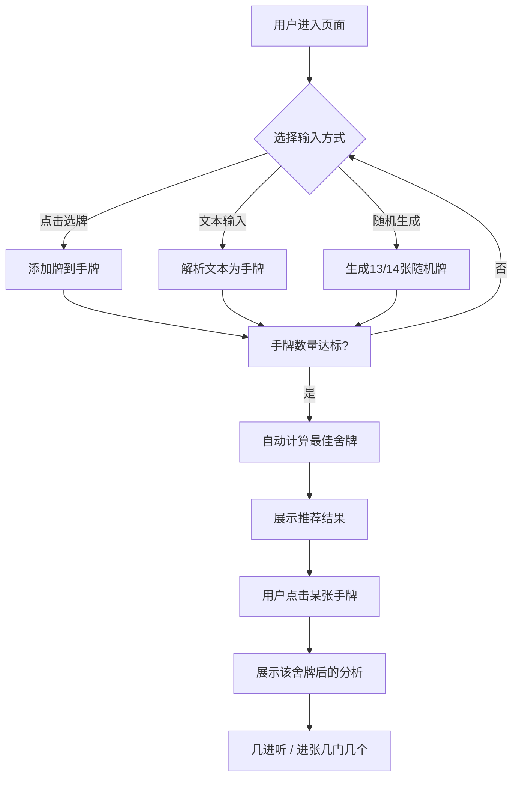

# 成都麻将缺一门舍牌训练工具 - 产品需求文档

## 1. 产品概述

成都麻将缺一门舍牌训练工具是一款面向麻将爱好者的在线训练应用。用户输入手牌后，系统自动分析最佳舍牌策略，判断打出每张牌后的听牌状态（几进听）和进张情况（几门几个），帮助用户提升舍牌决策能力。

核心目标：通过直观的交互和精准的算法，让用户快速掌握成都麻将"缺一门"玩法的舍牌技巧。

## 2. 核心功能

### 2.1 功能模块

1. **手牌输入模块**
2. **手牌展示模块**
3. **最佳舍牌推荐模块**
4. **用户舍牌分析模块**

### 2.2 页面详情

| 页面 | 模块 | 功能描述 |
|------|------|----------|
| 主页面 | 牌型选择区 | 点击27种麻将牌（1-9万、1-9筒、1-9条）添加到手牌 |
| 主页面 | 文本输入区 | 输入格式如 w1234t1234s1234，w=万, t=筒, s=条 |
| 主页面 | 随机生成区 | 选择生成13张或14张随机手牌 |
| 主页面 | 手牌展示区 | 展示当前已选的手牌，支持点击删除 |
| 主页面 | 最佳推荐区 | 自动计算并展示最优舍牌及分析结果 |
| 主页面 | 舍牌分析区 | 用户点击手牌中的任意一张，查看打出后的详细分析 |

## 3. 核心流程

## 4. 用户界面设计

### 4.1 设计风格

- **主题**：中国传统麻将风格，典雅沉稳
- **主色调**：深红色(#8B0000) + 金色(#DAA520) + 深灰背景(#1a1a2e)
- **牌面设计**：仿真实麻将牌，白色底+黑色/红色字，万为红色，筒为蓝色，条为绿色
- **按钮风格**：圆角矩形，金色边框，悬停发光效果
- **字体**：标题使用书法风格字体（Noto Serif SC），正文使用清晰的无衬线字体
- **布局**：卡片式布局，信息层级清晰

### 4.2 页面设计概述

| 页面 | 模块 | UI元素 |
|------|------|--------|
| 主页面 | 牌型选择区 | 三行牌型网格（万/筒/条），每张牌可点击选择 |
| 主页面 | 输入控制区 | 文本输入框、随机生成按钮（13张/14张）、清空按钮 |
| 主页面 | 手牌展示区 | 横向排列的麻将牌，点击可删除或分析 |
| 主页面 | 分析结果区 | 最佳推荐卡片、用户舍牌分析卡片 |

### 4.3 响应式设计

- **桌面端**：三列牌型网格，手牌横向展开，分析结果并排展示
- **移动端**：单列布局，牌型网格自适应缩放，手牌支持横向滚动

### 4.4 动画效果

- 牌型点击：缩放+金色光晕反馈
- 手牌添加：滑入动画
- 分析结果：淡入+上移
- 推荐标记：脉冲高亮
