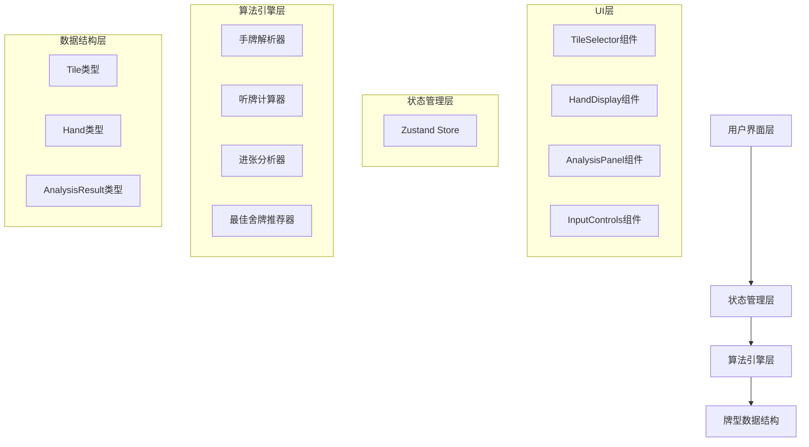

# 成都麻将缺一门舍牌训练工具 - 技术架构文档

## 1. 架构设计



## 2. 技术描述

- **前端框架**: React 18 + TypeScript
- **构建工具**: Vite
- **样式方案**: Tailwind CSS
- **状态管理**: Zustand
- **字体**: Noto Serif SC (标题) + system-ui (正文)
- **无后端**: 纯前端实现，所有算法在浏览器端运行

## 3. 路由定义

单页面应用，无需路由。

## 4. 核心模块设计

### 4.1 数据类型定义

```typescript
// 牌类型
interface Tile {
  suit: 'wan' | 'tong' | 'tiao';  // 万/筒/条
  value: number;                   // 1-9
}

// 手牌
interface Hand {
  tiles: Tile[];
}

// 分析结果
interface AnalysisResult {
  discardTile: Tile;        // 舍牌
  tingLevel: number;        // 几进听 (0=听牌, 1=一进听, etc.)
  waitingTiles: WaitingInfo[]; // 进张详情
  bestWaitCount: number;    // 最佳进张数
}

interface WaitingInfo {
  tile: Tile;               // 进张牌
  count: number;            // 剩余张数
}
```

### 4.2 核心算法模块

| 模块 | 文件 | 功能 |
|------|------|------|
| 牌型解析 | `src/utils/mahjong.ts` | 文本输入解析、牌型转换 |
| 听牌计算 | `src/utils/mahjong.ts` | 计算手牌距离听牌还需几步 |
| 进张分析 | `src/utils/mahjong.ts` | 计算听牌后的所有进张 |
| 最佳推荐 | `src/utils/mahjong.ts` | 遍历所有舍牌方案，找出最优 |

## 5. 算法核心思路

### 5.1 缺一门验证
- 检查手牌中万、筒、条三门中是否恰好缺一门
- 返回有效的两门

### 5.2 听牌判断（递归+动态规划）
- 将手牌按花色分组
- 对每组牌计算能组成的面子（顺子/刻子）和将牌
- 使用递归搜索所有组合方式
- 计算每种方式下距离完整牌型的差距

### 5.3 进张分析
- 对于给定的手牌状态，枚举所有可能的摸牌
- 判断摸牌后是否进入更低的听牌级别或听牌
- 统计有效进张的数量和门数

### 5.4 最佳舍牌
- 遍历手牌中每一张牌作为舍牌
- 计算打出后的手牌状态
- 比较各方案的进听级别和进张数
- 返回最优方案（进听级别最低，同级则进张最多）

## 6. 组件结构

```
src/
├── App.tsx                 # 主页面
├── components/
│   ├── TileSelector.tsx    # 牌型选择器（27张牌网格）
│   ├── HandDisplay.tsx     # 手牌展示（可点击删除/分析）
│   ├── AnalysisPanel.tsx   # 分析结果面板
│   └── InputControls.tsx   # 输入控制（文本输入、随机生成）
├── store/
│   └── gameStore.ts        # Zustand状态管理
├── utils/
│   └── mahjong.ts          # 核心麻将算法
└── types/
    └── index.ts            # 类型定义
```
