## 缺一门-血战到底

本人才疏学浅，对麻将所知不多，只是在前几天的陪练中逐渐熟悉了成都麻将-缺一门（又叫血战到底）的基础玩法，所以编写的这个工具就是围绕缺一门而展开，至于其他类型的麻将玩法，总体上差别不大，所以也应当具有一定的参考价值。

为了便于使用，本工具基于H5网页制作，采取三标签布局，对应三个核心功能区：定制选牌、手牌分析、牌型浏览。彼此之间可自由切换、灵活跳转。

### 选牌

分两个部分：图案选牌和文本输入。

#### 1、点击图案

图案选牌最常用，它是模拟实体麻将形象，用户用鼠标点击或手指触摸牌面即可将其选中（变色显示）。同一张牌最多选中4次，用角标数字（蓝底白字）表明一张牌的选中次数。如果点击一次角标，就可减少一次选中，角标数字小于1则选中状态消失，非常直观便捷。

#### 2、文本输入

至于文字输入选牌（格式: w=万, t/p=筒, s=条，如 w1234t5678s123），一般很少使用，保留它主要是为了和国际接轨，因为专业人士之间切磋习惯用这种方式。

无论采取哪种方式选牌，彼此之间都是实时联动更新：用户既可以从“确定选牌”和“确定输入”的角标数字上知晓已选的麻将总数，同时选中的牌也进入了手牌显示区，并在手牌标签页显示出来。

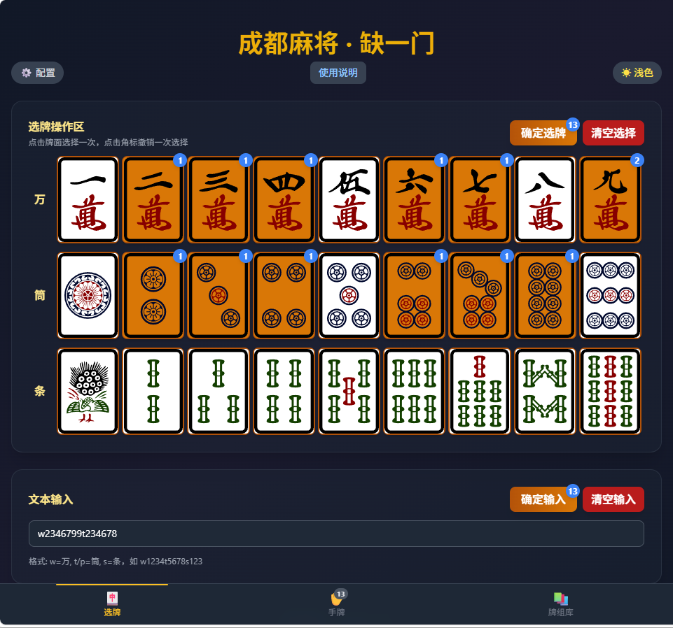

### 手牌

手牌标签页顶部有快捷按钮，可随机生成13张牌（判断是否听牌）、14张牌（判断如何舍牌）。

由于13张牌是训练重点，工具中还提供快捷方式生成一进听牌、二进听牌，以及已经听牌的牌型。

已经听牌的牌型是通过“N面听牌”按钮实现，用户可通过下拉框选择是生成听1-9面牌型，还是“随机”生成听牌牌型。

此功能区的核心是当前手牌显示区，此处为手牌提供了丰富实用的多种操作选项。包括：手牌拖拽排序、手牌变色标注、手牌删除、手牌补牌、分析选牌、最佳舍牌等，下面截图演示。

#### 1、补牌删牌

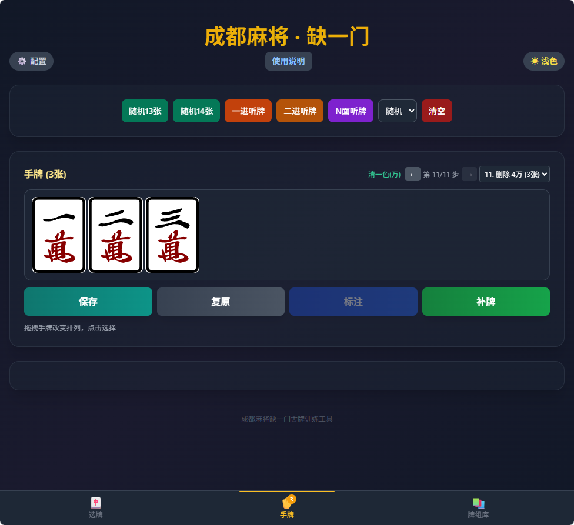

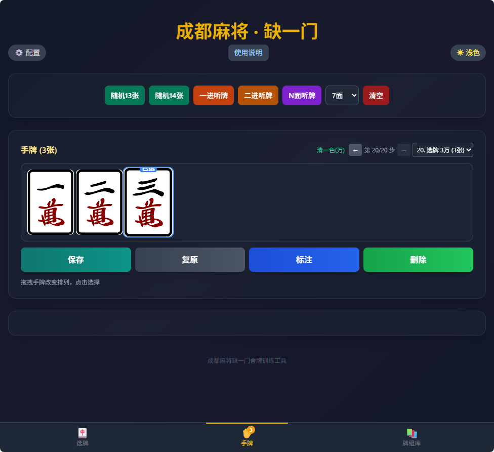

#### 2、手牌标注

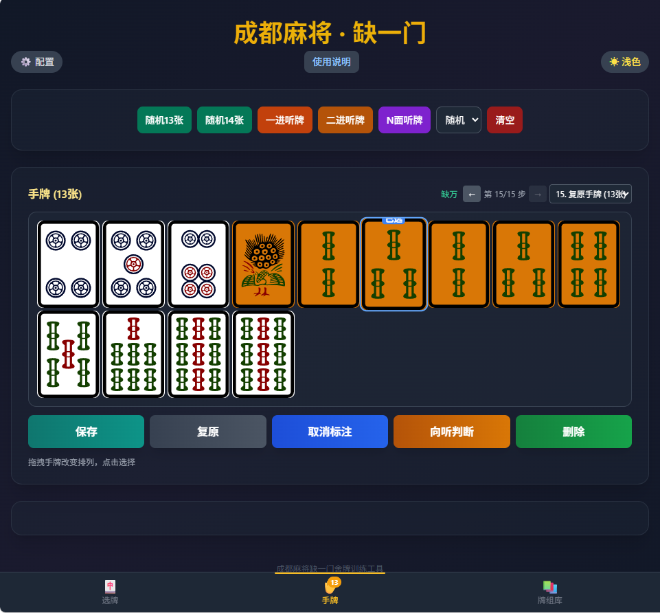

#### 3、向听判断

在手牌为1、4、7、10、13张时，可以判断当前向听状态、是否听牌。如果听牌，点击听牌详情，可生成胡牌组合直观对照。

3-1、一进听牌

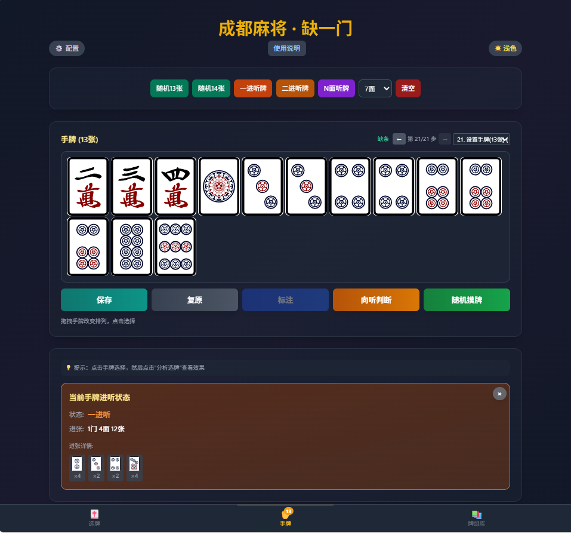

3-2、听牌牌型

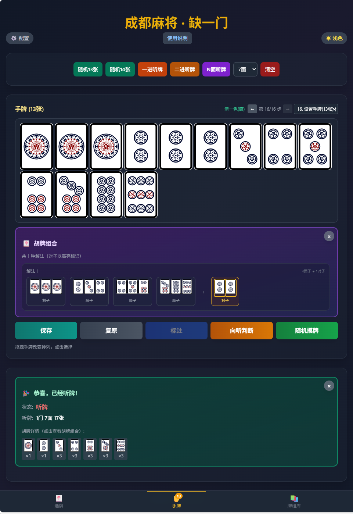

#### 4、最佳舍牌

在手牌为2、5、8、11、14张时，可判断打出哪张为最佳舍牌。

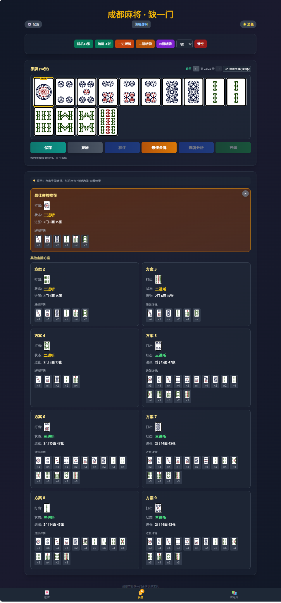

#### 5、手动舍牌

判断手动舍牌是否符合牌效率，这特别适合模拟打牌，训练出牌质量。

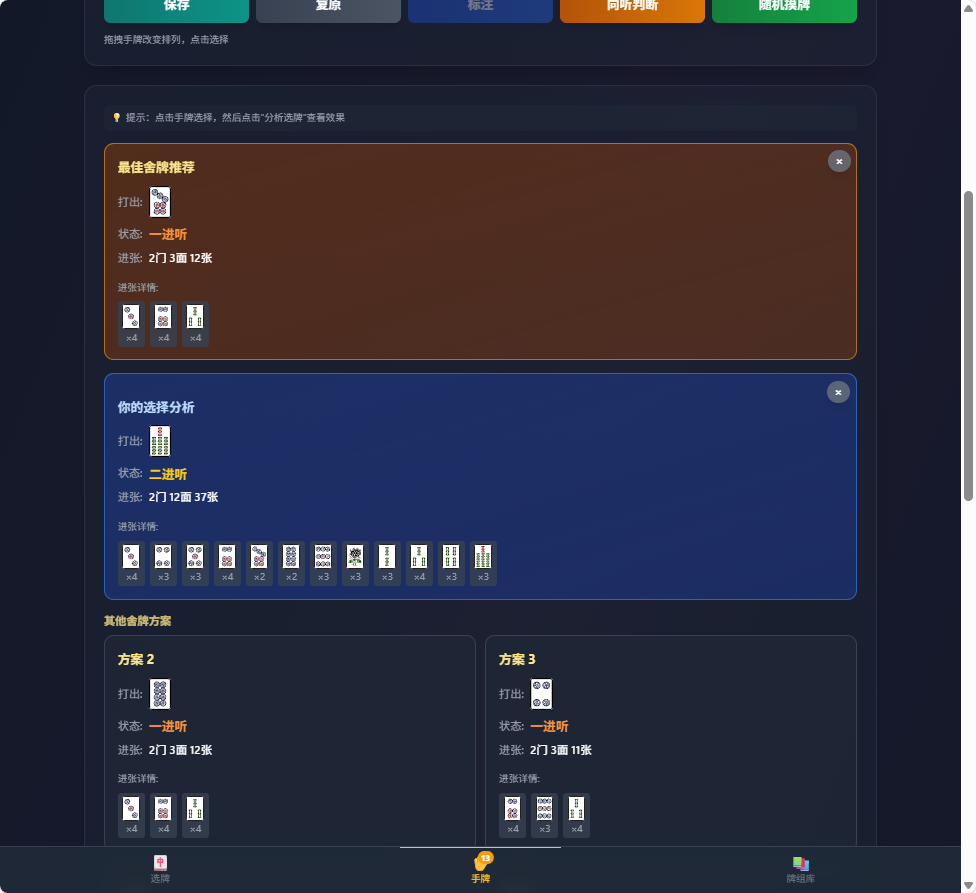
#### 6、保存牌组

如果中意的手牌组合，可以点击“保存”，加上说明文字，存入本地数据库，方便以后浏览复盘。

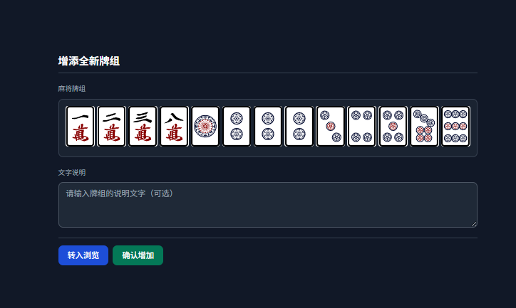

#### 7、撤销重做

手牌操作带撤销重做功能，下拉框中有一个简要的历史记录可供回溯。

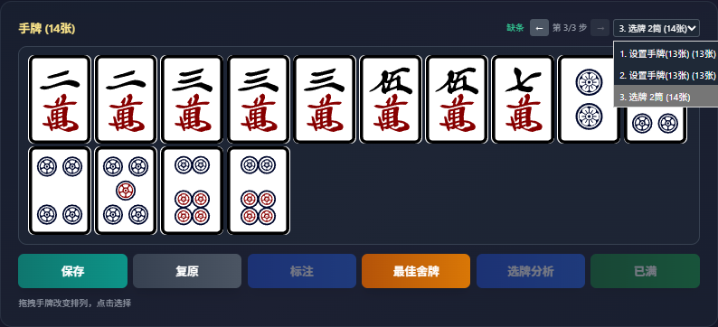

### 牌组库

可以在手牌标签页把中意的牌组保存到本地数据库中，本地数据库可以浏览、修改、分享、查找、导入导出。这是帮助麻友积累经验、提升技能的大本营。

#### 1、设置显示范围

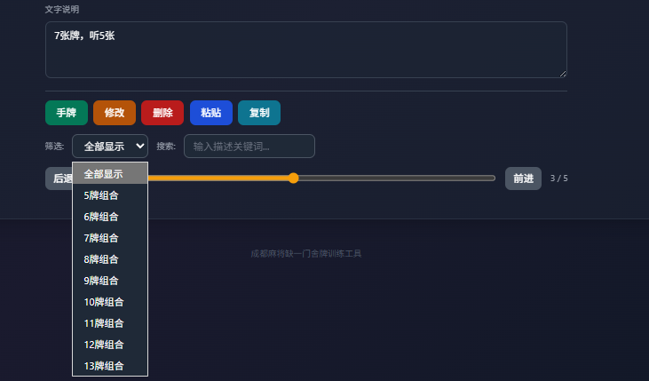

#### 2、搜索关键词

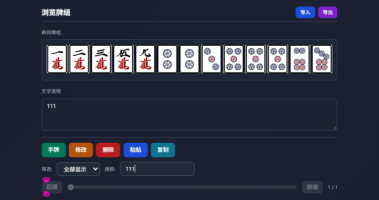

#### 3、分享-单条记录

3-1、复制单条记录

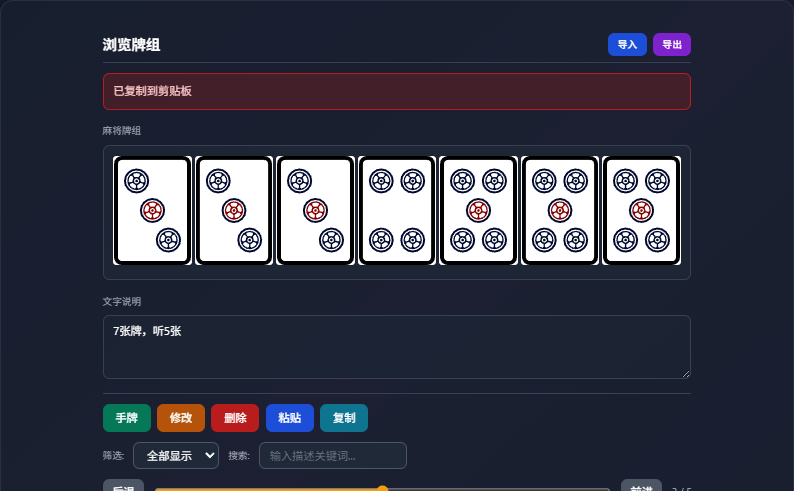
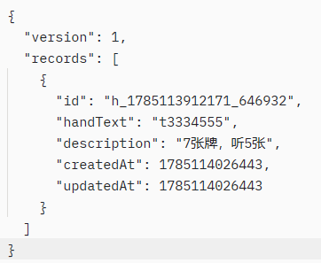

3-2、粘贴单条记录

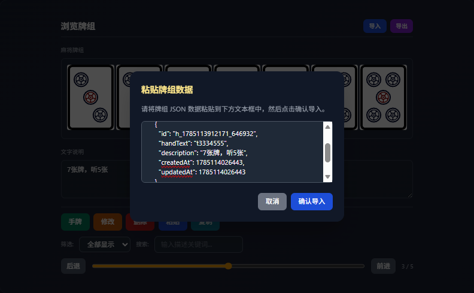

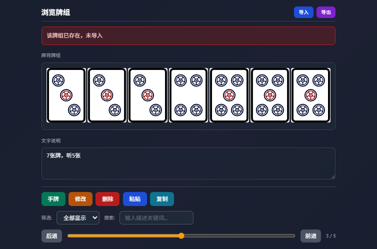

#### 4、导入导出数据库

可以把整个数据库导出为本地文件（json格式），也可从本地文件中导入数据库（自动判断数据有效性并去重保存）。该功能可以实现跨设备分享牌组数据。

4-1、导出数据库

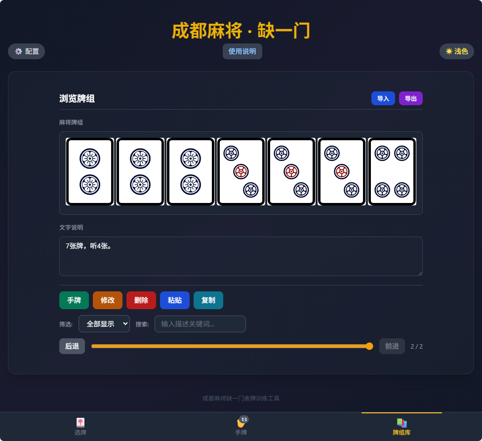

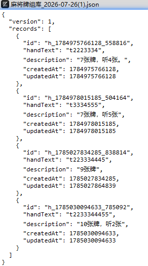

4-2、导入数据库

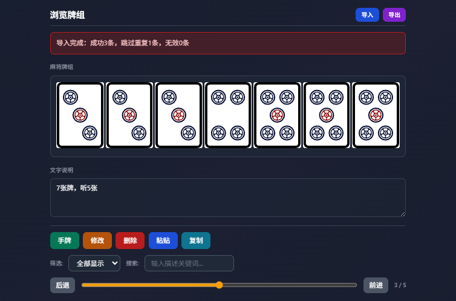

## 写在最后

开发本工具的初衷原本是方便提升自己的麻将技能，但其中迭代也花费了不少心血。考虑到肯定还有其他麻友像我一样也苦于找不到合适的工具提升功力，于是决定将其分享给广大有缘朋友，毕竟，独乐乐不如众乐乐。

文件：

麻将训练 v1.0.exe （默认窗口：900✖️700像素）

麻将训练 v1.00.apk

温馨提示：

exe是单文件便携版，采用Tauri打包，无需安装，下载到windows电脑中直接双击运行。

apk是安卓版本，采用Capacitor打包，下载到手机上直接安装。

其他操作提示，请点击工具界面顶部的“使用说明”。如果觉得好用，可以在作者信息处扫码请他喝一杯咖啡，谢谢。

